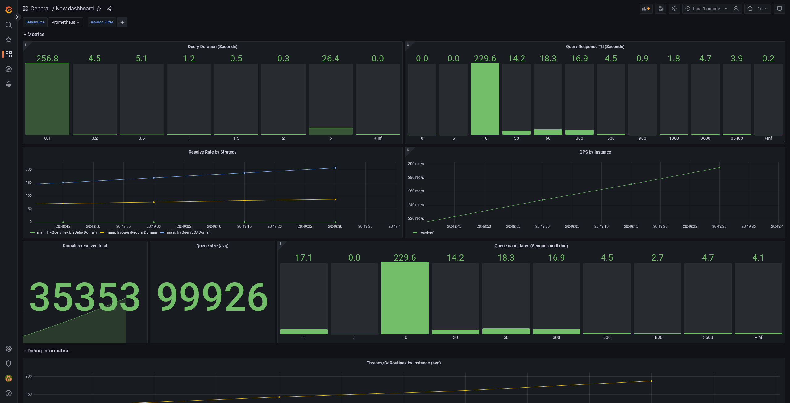
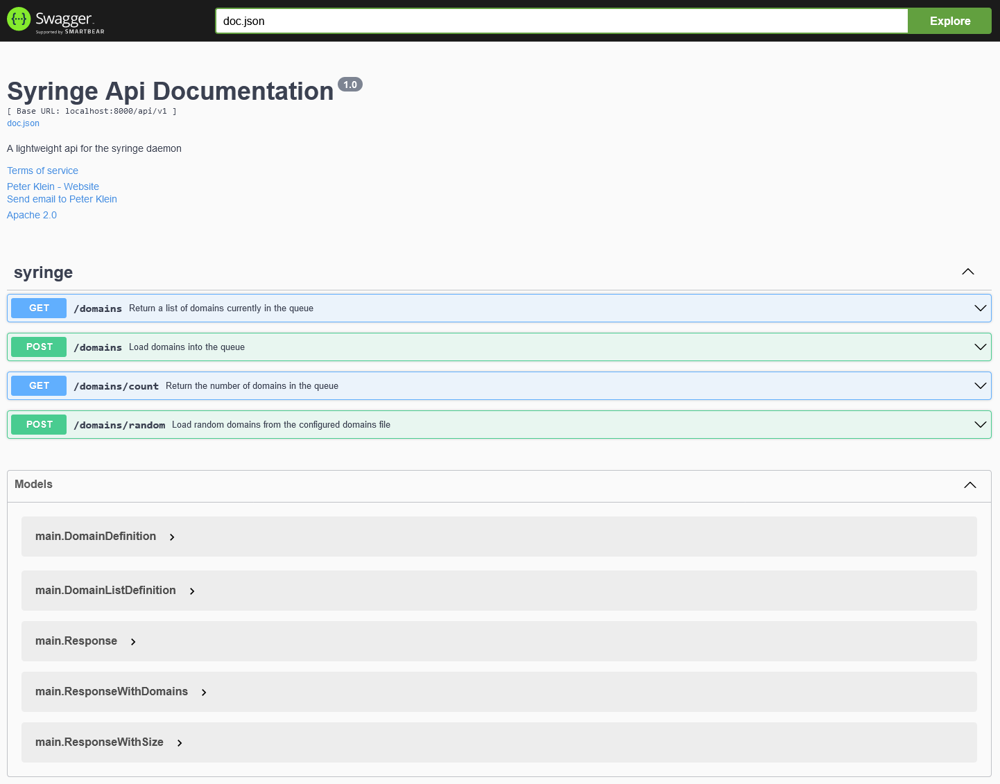

<!-- Improved compatibility of back to top link: See: https://github.com/TCMPK/syringe/pull/73 -->
<a name="readme-top"></a>

<!-- PROJECT SHIELDS -->
[![Contributors][contributors-shield]][contributors-url]
[![Forks][forks-shield]][forks-url]
[![Stargazers][stars-shield]][stars-url]
[![Issues][issues-shield]][issues-url]
[![Swagger][swagger-shield]][issues-url]
[![Go Version][go-mod-shield]][issues-url]


<!-- PROJECT LOGO -->
<br />
<div align="center">
  <a href="https://github.com/TCMPK/syringe">
    
  </a>

  <h3 align="center">Syringe</h3>

  <p align="center">
    The missing dns-preheating daemon!
    <br />
    <a href="https://github.com/TCMPK/syringe"><strong>Explore the docs »</strong></a>
    <br />
    <br />
    <a href="https://github.com/TCMPK/syringe/tree/main/.github/assets">Screenshots</a>
    ·
    <a href="https://github.com/TCMPK/syringe/issues">Report Bug</a>
    ·
    <a href="https://github.com/TCMPK/syringe/issues">Request Feature</a>
  </p>
</div>

<!-- TABLE OF CONTENTS -->
<details>
  <summary>Table of Contents</summary>
  <ol>
    <li>
      <a href="#about-the-project">About The Project</a>
      <ul>
        <li><a href="#built-with">Built With</a></li>
      </ul>
    </li>
    <li>
      <a href="#getting-started">Getting Started</a>
      <ul>
        <li><a href="#prerequisites">Prerequisites</a></li>
        <li><a href="#installation">Installation</a></li>
      </ul>
    </li>
    <li><a href="#usage">Usage</a></li>
    <li><a href="#roadmap">Roadmap</a></li>
    <li><a href="#contributing">Contributing</a></li>
    <li><a href="#license">License</a></li>
    <li><a href="#contact">Contact</a></li>
    <li><a href="#acknowledgments">Acknowledgments</a></li>
  </ol>
</details>


<!-- ABOUT THE PROJECT -->
# About The Project

During my quest to improve customer satisfaction, I asked myself how I may reduce the impact on customers dns response times during frequent component replacements (the component is a dns-resolver in this case if you mind asking).

Background:
In a setup where services are announced via bgp, any component is suspect to hot replacement. 
DNS-resolver heavily rely on their query cache to answer valid or bogus queries as fast as possible. When spinning up a new server, it may experience full production traffic without a filled cache. This may lead to clogged query upstreams or even a brief period of blacklisting if a common upstream resolver (e.g. tiering) is used. To address this issue, this project was started.

Side note: This is also a "java programmer"'s first take on a `go` application which is perfect for this use-case.

<p align="right">(<a href="#readme-top">back to top</a>)</p>

<!-- USAGE EXAMPLES -->
# Usage

> **_NOTE:_** 
> Please download/build a specific release first
> See [Releases](https://github.com/TCMPK/syringe/releases) for prebuilt artifacts

Usage is as easy as:
```sh
# linux/mac
./syringe PARAMS
# windows
.\syringe.exe PARAMS
```

## Command-Line Parameters (PARAMS)
| Flag        | Value       | Default     | Description |
| ----------- | ----------- | ----------- | ----------- |
| -help       | (none)      |             | Print a help message showing all available flags |
| -config     | Valid Path  | syringe.yml | Use the specified config instead of the default |

# Configuration (syringe.yml)

_For informations regarding the configuration file, please refer to the [Documentation](https://github.com/TCMPK/syringe/wiki/Configuration-Parameters)_

<p align="right">(<a href="#readme-top">back to top</a>)</p>

<!-- GETTING STARTED -->
# Building

Getting started is easy as there are many methods to start right away!

* First clone the repository
    ```sh
    git clone https://github.com/TCMPK syringe
    ```
* `cd` into the cloned directory
    ```sh
    cd syringe
    ```

## docker-compose

### Preprequisites
* `docker`
* `docker-compose`

### Build & Run the application

* Build the image and start an attached compose-stack
    ```sh
    docker-compose up # will do a "docker-compose build" if the image does not exist
    ```
* Open `http://localhost:8000/docs/index.html` which which should present you with the swagger-api documentation. Now you can get your hands on

## Docker

### Preprequisites
* `docker`

### Build & Run the application

* Build the image
    ```sh
    docker build -t syringe . # build the image named "syringe" in the current directory .
    ```
* Start the container and attach
    ```sh
    # The api is listining on 0.0.0.0:8000 so we need to map the port
    docker run -it -p 8000:8000 syringe # start the container and attach stdout/stdin 
    ```
* Open `http://localhost:8000/docs/index.html` which which should present you with the swagger-api documentation. Now you can get your hands on

## Bare Metal (Linux, Mac, Windows)

### Preprequisites
* `golang`
* `gcc`

### Build & Run the application

* Download all modules
    ```sh
    go mod download
    ```
* Build
    ```sh
    # build linux/mac
    go build -o syringe
    # windows 
    go build -o syringe.exe
    ```
* Run
    ```sh
    # linux/mac
    ./syringe
    # windows
    .\syringe.exe
    ```
* Open `http://localhost:8000/docs/index.html` which which should present you with the swagger-api documentation. Now you can get your hands on

<p align="right">(<a href="#readme-top">back to top</a>)</p>

<!-- SCREENSHOTS -->
# Screenshots

Grafana Dashboard `grafana/dashboard.json`


Swagger Documentation `http://localhost:8000/docs/index.html`


<p align="right">(<a href="#readme-top">back to top</a>)</p>

<!-- ROADMAP -->
# Roadmap

See the [open issues](https://github.com/TCMPK/syringe/issues) for a full list of proposed features (and known issues).

<p align="right">(<a href="#readme-top">back to top</a>)</p>

<!-- CONTRIBUTING -->
# Contributing

Contributions are what make the open source community such an amazing place to learn, inspire, and create. Any contributions you make are **greatly appreciated**.

If you have a suggestion that would make this better, please fork the repo and create a pull request. You can also simply open an issue with the tag "enhancement".
Don't forget to give the project a star! Thanks again!

1. Fork the Project
2. Create your Feature Branch (`git checkout -b feature/AmazingFeature`)
3. Commit your Changes (`git commit -m 'Add some AmazingFeature'`)
4. Push to the Branch (`git push origin feature/AmazingFeature`)
5. Open a Pull Request

<p align="right">(<a href="#readme-top">back to top</a>)</p>

<!-- LICENSE -->
# License

Distributed under the Apache license 2.0.

<p align="right">(<a href="#readme-top">back to top</a>)</p>

<!-- CONTACT -->
## Contact

Peter Klein - peter@tcmpk.de

Project Link: [https://github.com/TCMPK/syringe](https://github.com/TCMPK/syringe)

<p align="right">(<a href="#readme-top">back to top</a>)</p>

<!-- MARKDOWN LINKS & IMAGES -->
<!-- https://www.markdownguide.org/basic-syntax/#reference-style-links -->
[swagger-shield]: https://img.shields.io/swagger/valid/3.0?specUrl=https%3A%2F%2Fgithub.com%2FTCMPK%2Fsyringe%2Fblob%2Fmain%2Fdocs%2Fswagger.json

[contributors-shield]: https://img.shields.io/github/contributors/TCMPK/syringe
[contributors-url]: https://github.com/TCMPK/syringe/graphs/contributors
[forks-shield]: https://img.shields.io/github/forks/TCMPK/syringe
[forks-url]: https://github.com/TCMPK/syringe/network/members
[stars-shield]: https://img.shields.io/github/stars/TCMPK/syringe
[stars-url]: https://github.com/TCMPK/syringe/stargazers
[issues-shield]: https://img.shields.io/github/issues/TCMPK/syringe
[issues-url]: https://github.com/TCMPK/syringe/issues
[swagger-shield]: https://img.shields.io/swagger/valid/3.0?specUrl=https%3A%2F%2Fgithub.com%2FTCMPK%2Fsyringe%2Fblob%2Fmain%2Fdocs%2Fswagger.json
[go-mod-shield]: https://img.shields.io/github/go-mod/go-version/TCMPK/syringe